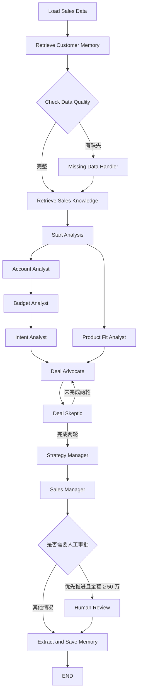

# Sales Agent Demo

一个面向 B2B 销售机会管理的多 Agent 决策系统。它把 CRM、会议纪要、产品目录、客户历史记忆和销售知识库组合起来，对一个销售机会进行结构化分析，最终给出：

- `优先推进`
- `潜在机会`
- `建议终止`

系统的重点不是让一个模型直接“拍板”，而是把销售判断拆成多个业务角色，经过证据检查、并行分析、正反方辩论和销售经理汇总后再形成决策。对于高金额且建议推进的机会，流程会暂停并等待人工审批。

> 当前项目是一个可运行的 Workflow 原型。数据源仍是本地 JSON，生产环境还需要接入真实 CRM、鉴权、审计、监控和更完整的服务化接口。

## 业务逻辑

一次销售机会分析回答四个问题：

1. 客户现在处于什么状态，是否存在明确的购买信号？
2. 客户预算、产品需求和当前方案是否匹配？
3. 这个机会有哪些证据支持继续投入，哪些风险可能导致失败？
4. 下一步应该投入什么销售动作，是否需要人工审批？

系统遵循几条业务原则：

- **事实优先**：CRM 和会议数据是当前机会的直接事实；缺失信息必须标记为未知，模型不能自行补全。
- **分析与决策分离**：分析 Agent 只负责提供报告，最终决策由 Sales Manager 统一输出。
- **正反方校验**：Deal Advocate 寻找推进依据，Deal Skeptic 专门发现证据不足和成交风险。
- **风险分级处理**：普通机会自动完成，高金额且建议推进的机会进入人工审批。
- **客户级记忆**：最终决策和审批结果按 `customer_id` 保存，供后续机会参考。
- **知识范围隔离**：客户对话严格按客户过滤；成功案例和 SOP 通过租户与语料类型进行隔离。

## Workflow 总览



## Workflow 节点

| 阶段 | 节点 | 业务职责 |
| --- | --- | --- |
| 数据准备 | `load_sales_data` | 并发读取 CRM、会议纪要和产品目录，形成当前机会的事实基础。 |
| 历史上下文 | `retrieve_customer_memory` | 读取该客户最近的销售决策和审批记忆，作为历史参考，不覆盖当前事实。 |
| 数据质量 | `check_data_quality` | 检查 CRM、会议纪要和产品目录是否整体缺失。 |
| 数据质量 | `missing_data_handler` | 生成缺失说明，要求后续 Agent 明确区分“未知”和“事实”。它不会伪造数据或自动补数。 |
| 知识检索 | `retrieve_sales_knowledge` | 使用统一查询检索客户对话、成功案例和销售 SOP；知识库关闭或检索失败时降级为空证据。 |
| 分析启动 | `start_analysis` | 开启 Account 分析链和 Product Fit 分析链。 |
| 客户分析 | `account_analyst` | 判断客户状态、正负信号和仍需确认的信息。 |
| 预算分析 | `budget_analyst` | 判断预算与交易金额的匹配度，并识别预算风险。 |
| 意向分析 | `intent_analyst` | 判断购买意向、项目成熟度和需要验证的意向信号。 |
| 产品分析 | `product_fit_analyst` | 将客户需求、预算和产品目录进行匹配，识别产品差距。 |
| 正方辩论 | `deal_advocate` | 基于事实寻找值得继续投入资源的理由和可执行动作。 |
| 反方辩论 | `deal_skeptic` | 检查正方观点中的证据缺口、成交风险和不成立的假设。 |
| 策略归纳 | `strategy_manager` | 综合两轮辩论，形成销售策略和优先验证动作，不直接进行投票。 |
| 最终决策 | `sales_manager` | 综合原始事实、数据质量、分析报告、辩论、策略和 RAG 证据，输出结构化决策。 |
| 人工审批 | `human_review` | 对高金额且“优先推进”的机会暂停 Workflow，收集批准结果和审批意见。 |
| 长期记忆 | `extract_and_save_memory` | 保存最终决策、风险、下一步行动、未知信息和审批结果。 |

### 两条分析路径

`Account → Budget → Intent` 是有上下游依赖的串行链：预算分析需要客户分析，意向分析需要前两者的结果。

`Product Fit` 不依赖这条链，因此与 `Account` 同时执行。两条路径完成后，结果汇合到 `Deal Advocate`。

### 辩论与审批规则

- Advocate 和 Skeptic 默认进行两轮交替辩论。
- 双方都不能直接输出最终销售结论，只能提供证据、风险和验证建议。
- Sales Manager 只能输出经过 Pydantic 校验的结构化结果。
- 当最终决策为 `优先推进` 且 CRM 中的 `deal_amount >= 500000` 时，进入 `Human Review`。
- 无论是否经过人工审批，最终结果都会尝试写入客户长期记忆。

## 数据与存储

### 当前机会数据

项目使用 `data/` 下的示例 JSON 作为输入：

| 文件 | 用途 |
| --- | --- |
| `opportunities.json` | 选择待分析的销售机会。 |
| `crm.json` | 客户、金额、阶段、预算、竞争对手和决策人等事实。 |
| `meetings.json` | 当前客户的会议纪要。 |
| `products.json` | 产品、价格区间、目标客户和能力列表。 |

`customer_id` 是 CRM、会议记录、长期记忆和客户对话知识之间的主要隔离键。

### PostgreSQL 存储

- **LangGraph Checkpoint**：保存 Workflow 状态，支持人工审批后的恢复执行。
- **`sales_memories`**：按客户保存历史销售决策和审批结果。
- **`knowledge_chunks`**：保存经过切片和 Embedding 的客户对话、成功案例与销售 SOP。

知识库使用 PostgreSQL + pgvector。知识库默认关闭，开启后会在分析 fan-out 之前统一检索，再把不同类型的证据分发给需要的 Agent。

## 上下文与模型调用

`ContextBuilder` 为每个 Agent 选择最小必要上下文：

- Account Analyst 主要接收客户事实、会议纪要和客户对话证据。
- Budget Analyst 主要接收金额、预算、客户分析和 SOP 证据。
- Product Fit Analyst 主要接收产品目录、需求和成功案例。
- Sales Manager 才接收完整的分析报告、辩论结果、数据质量报告和检索警告。

这样可以减少无关上下文，并降低不同角色之间的信息污染。

`harness.py` 统一处理模型调用、重试、超时和结构化 JSON 解析。`policy.py` 保存最终决策枚举和人工审批金额阈值，避免应用逻辑与评测逻辑出现规则漂移。

## 最小运行方式

项目需要 Python、DeepSeek 兼容模型服务和 PostgreSQL/pgvector。配置环境变量后即可启动本地数据库并运行：

```bash
pip install -r requirements-postgres.txt
docker compose up -d postgres
python app.py C102
```

环境变量模板见 `.env.example`。真实 API Key 只应放在本地 `.env` 或部署平台的 Secret 中，不要提交到 Git。

## 项目结构

```text
sales-agent-demo/
├── app.py                  # LangGraph Workflow 与 CLI 入口
├── harness.py              # 模型调用、重试和结构化输出
├── context_manager.py      # Agent 最小上下文装配
├── memory.py               # PostgreSQL 客户长期记忆
├── knowledge_store.py      # pgvector 知识库检索
├── ingest_knowledge.py     # 知识文件切片与摄取
├── policy.py               # 决策枚举与审批阈值
├── tools.py                # CRM、会议和产品数据读取
├── compose.yaml            # 本地 PostgreSQL/pgvector
├── data/                   # 脱敏后的示例业务数据
├── .env.example            # 环境变量模板
├── reviewer.py             # 可选的 LLM-as-Judge 评审模块
└── eval_live.py            # 可选的在线评测入口
```

## 当前边界

- 当前入口面向本地 CLI，尚未提供 Web/API 服务。
- 数据源是示例 JSON，不是实际 CRM 系统。
- 数据质量检查目前针对整体数据缺失，尚未覆盖所有字段级校验。
- LLM、Embedding 和 PostgreSQL 都依赖外部服务。
- 复杂 PDF、OCR 和文档解析需要额外接入解析服务。

## 安全说明

- `.env`、本地数据库、知识库文件和评测结果不应提交到公开仓库。
- `data/` 中的业务内容应使用虚构或脱敏数据。
- 生产环境应使用 Secret Manager、数据库最小权限、租户级访问控制和完整审计日志。
